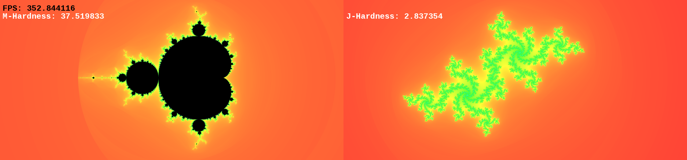

# CUDA Fractal Explorer

## Explore the Infinite Detail of Fractals

CUDA Fractal Explorer is an application designed for visualizing famous fractal sets like the **Mandelbrot** and **Julia** sets. It's built for **speed** and **smooth interaction**, allowing you to zoom deep into these complex mathematical landscapes.

It achieves this high performance by using your **NVIDIA graphics card (GPU)** with **CUDA** for fast calculations and optimized drawing. A **Graphical User Interface (GUI)**, powered by **TGUI**, provides easy controls for changing settings, while **SFML** handles the main window and graphics.

The main feature of the demo application is a dynamic **dual-view setup**: you see the Mandelbrot set on one side, and a Julia set on the other. Moving your mouse over the Mandelbrot set instantly updates the related Julia set, helping you understand the fascinating connection between them.

**No NVIDIA GPU? No problem!** The project includes a fallback that uses your computer's main processor (**CPU**) to render basic views, so you can still explore the basics (though performance will be significantly slower, as well as features).


_Screenshot of the dual-view demo application_

## Key Features You'll Love

*   **Blazing Fast Rendering:** Uses your NVIDIA GPU to calculate and draw fractals much faster than standard CPU methods. It's smart enough to switch between faster `float` math and more accurate `double` math automatically as you zoom deeper.
*   **CPU Friendly:** If you don't have a CUDA-enabled NVIDIA graphics card, the application can switch to a multi-threaded CPU mode to render basic views.
*   **See the Mandelbrot and Julia Sets:** Explore two of the most iconic fractals. The code is also structured to easily add other types later.
*   **Linked Views:** Interact with the Mandelbrot set to see how it changes the Julia set in real-time on the side-by-side display. You can turn this linking on or off.
*   **Draw Your Own Fractals:** **(Advanced!)** Write your own mathematical formula directly in the application using the built-in **runtime compiler (NVRTC)** and see it rendered instantly!
    
    _The custom formula input area_
*   **Switch Rendering Modes:** Easily toggle between using the standard, included rendering code (CUDA) and your own custom formulas compiled on-the-fly (NVRTC).
*   **Sharp Images When Still:** Automatically improves the image quality when you stop moving. It renders at a higher resolution and uses **4x Super-Sampling Anti-Aliasing (SSAA)** to make edges smoother and details clearer.
*   **Change the View Size:** Set the resolution for the Mandelbrot and Julia views independently, right from the interface.
*   **Lots of Colors:** Pick from a wide variety of built-in color schemes (like Fire, Water, Psychedelic, Deep Space, and more!). A slider lets you fine-tune some palettes like the classic HSV one.
    
    _Color palette and HSV offset controls_
*   **Control the Detail:** Adjust how many calculations (iterations) are performed for each pixel. Higher numbers show more detail, especially in deep zooms. There's an optional mode to automatically increase iterations as you explore.
*   **Easy Navigation:** Zoom with your mouse wheel and pan by clicking and dragging. You can also nudge the Mandelbrot view using the WASD keys.
*   **See the Path:** Hold the right mouse button over the Mandelbrot set to visualize the escape path of the point under your cursor – a cool way to see the math in action.
    
    _Visualizing the escape path_
*   **Julia Set Animation:** **(Experimental!)** Toggle a mode where the Julia set constantly changes parameters, creating a mesmerizing, evolving animation.
*   **Save Your Views:** Press a key to quickly save a screenshot of the Mandelbrot view.

## How It's Built (Technical Details)

*   **Core Calculation Engine:** C++20 and **CUDA C++** (Leveraging the GPU's parallel power).
*   **Drawing & Window:** **SFML 3** (Simple and Fast Multimedia Library - handles displaying graphics and managing the application window).
*   **User Interface:** **TGUI 1** (Texus' Graphical User Interface - provides all the buttons, sliders, menus you see).
*   **Custom Code Compilation:** **NVIDIA NVRTC** (Allows compiling CUDA code *while the application is running* for custom formulas).
*   **Building the Project:** **CMake** (A standard tool for managing the build process across different systems).
*   **Getting Libraries:** **vcpkg** (A package manager that simplifies downloading and setting up SFML and TGUI).

## What You Need to Run It

*   **Hardware:**
    *   An **NVIDIA graphics card** with **Compute Capability 3.0 or higher**. The build process tries to automatically configure for your specific card. (If you don't have a compatible NVIDIA GPU, you can still run the CPU fallback, but performance will be limited, as well as features).
*   **Software:**
    *   The **NVIDIA CUDA Toolkit**. You'll need a version that works with your graphics card and your C++ compiler.
    *   A modern C++ compiler that supports **C++20** features (like GCC, Clang, or MSVC).
    *   **CMake** (Version 3.30 or newer).
    *   **vcpkg**. This tool will download and set up the other libraries for you. You can find setup instructions [here](https://vcpkg.io/en/getting-started.html).

## Getting Started (Building the Project)

This project uses vcpkg to make setting up SFML and TGUI easy.

1.  **Download the code:**
    ```bash
    git clone https://github.com/NeKon69/MandlebrotSetSFML.git
    cd MandlebrotSetSFML
    ```
2.  **Tell CMake where to find vcpkg.** If you followed the vcpkg setup, you likely have a `vcpkg.cmake` file. You need to tell CMake where this file is.
3.  **Prepare the build:** Use CMake to configure the project. Replace `<path_to_vcpkg>` with the actual location of your vcpkg installation.
    ```bash
    # Example command (adjust path as needed)
    cmake -B build -S . -DCMAKE_BUILD_TYPE=Release -DCMAKE_TOOLCHAIN_FILE=<path_to_vcpkg>/scripts/buildsystems/vcpkg.cmake
    ```
    This command creates a `build` folder and sets up the project files inside it.
4.  **Compile the code:** Use CMake to build the executable.
    ```bash
    cmake --build build --config Release
    ```
    This step compiles all the C++ and CUDA code and creates the final program.

## Running the Application

Once the build finishes successfully, you'll find the executable inside the `build` directory (it might be in a subdirectory like `build/Release` depending on your system and CMake generator). The necessary fonts and image files will be copied there automatically.

```bash
cd build
# On Linux/macOS:
./MandelbrotProject
# On Windows (if using Visual Studio build):
.\Release\MandelbrotProject.exe
```
The application should open in a borderless window matching your desktop resolution.

## How to Use the Demo Application

The main window shows the Mandelbrot set on the left and the Julia set on the right. Most controls affect the fractal area your mouse cursor is currently over.

*   **Mouse Wheel:** Zoom in or out, centered on where your mouse is pointing. (Affects left or right view).
*   **Left Mouse Button + Drag:** Move the fractal view around. (Affects left or right view).
*   **Right Mouse Button (Hold, over Mandelbrot):** See the calculation path for the point under your mouse in the Mandelbrot set.
*   **Mouse Movement (Over Mandelbrot):** The Julia set on the right will change based on the complex coordinate under your mouse cursor in the Mandelbrot view. (Unless you've blocked this).
*   **`W`/`A`/`S`/`D` Keys (Over Mandelbrot):** Slightly move the Mandelbrot view up, left, down, or right.
*   **`B` Key (Over Mandelbrot):** Turn the automatic Julia set updating (linked to mouse movement) on or off.
*   **`T` Key:** Turn the experimental Julia Set Animation (timelapse) mode on or off.
*   **`Esc` Key:** Close the application.
*   **`F6` Key:** Save a screenshot of the Mandelbrot view as a JPG file in the same folder as the executable.
*   **`F12` Key (Over Mandelbrot):** Force both fractal views to re-render immediately.
*   **Dropdown Menu (Top Left/Right):** Choose a different color scheme for the Mandelbrot or Julia set.
*   **Color Slider (Top Left/Right):** Adjust the starting point for colors in palettes like 'HSV'.
*   **Resolution Input (Top Left/Right):** Type in a custom width and height (e.g., "1920x1080") to change the size of the fractal view. Press Enter or click away to apply.
*   **Iterations Input/Slider (Top Left/Right):** Manually set the maximum number of iterations used for calculations.
*   **"Progressive Iterations" Checkbox (Top Left/Right):** When checked, the application will automatically increase the max iterations for deeper views or when idle, adding more detail over time.
*   **"Reset [Fractal]" Button (Top Left/Right):** Restore the zoom, position, and other settings of that specific fractal view to their starting defaults.
*   **Context Dropdown (Mandelbrot Left):** Switch between using the built-in, optimized code (CUDA) and using custom formulas you provide (NVRTC).
*   **Custom Code Area (Mandelbrot Left):** If in NVRTC context, type or paste your own mathematical formula here. It replaces the core calculation step in the fractal loop.
*   **"Compile!" Button (Mandelbrot Left):** Compile the code from the custom area. If successful, the fractal view will update with your new formula. Looks for syntax errors.
*   **Info Icon (Next to Custom Code Area):** Click to show/hide a detailed log of the compilation process, including any errors.
*   **Progress Bar (Below Custom Code Area):** Shows the progress when compiling a custom formula.
*   **"Start Cool Animation" Button (Julia Right):** Starts a visual effect that cycles the maximum iterations of the Julia set.

## For Developers: Using as a Library

If you're a C++ developer and want to use the core fractal rendering code in your own project (maybe building a different type of application), you can integrate the `FractalBase` class.

You'll need to include the main class header: `#include "ClassImplementation/FractalClass.cuh"` (adjust path based on your project structure). You'll also need to link your project against SFML, TGUI (if used), CUDA runtime, NVRTC, and the CUDA Driver API, similar to the main demo's `CMakeLists.txt`.

Here's a basic example of how you might use it:

```cpp
#include "ClassImplementation/FractalClass.cuh" // Adjust path as needed
#include <SFML/Graphics.hpp>
// Include TGUI headers if needed
#include <TGUI/TGUI.hpp>
#include <TGUI/Backend/SFML-Graphics.hpp>
#include <iostream>

int main() {
    // Standard SFML window setup
    sf::RenderWindow window(sf::VideoMode({1024, 768}), "My Custom Fractal App");
    // tgui::Gui gui(window); // Optional: Setup TGUI if you need UI controls

    // Check if CUDA is available (recommended for performance), not necessary
    int deviceCount;
    cudaError_t cudaInitResult = cudaGetDeviceCount(&deviceCount);
    bool isCudaAvailable = (cudaInitResult == cudaSuccess && deviceCount > 0);
    if (!isCudaAvailable) {
        std::cerr << "CUDA not available. CPU fallback will be used for basic rendering." << std::endl;
    }

    // Create a Mandelbrot fractal renderer object
    FractalBase<fractals::mandelbrot> mandelbrotRenderer;

    // Configure the renderer (resolution, palette, iterations, etc.)
    mandelbrotRenderer.set_resolution({1024, 768});
    mandelbrotRenderer.setPallete("IceCave");
    mandelbrotRenderer.set_max_iters(1000);

    // You can change view parameters like zoom and offset
    // mandelbrotRenderer.handleZoom(1.0, {512, 384}); // Example: Zoom in once centered

    // --- Example of using NVRTC for a custom formula ---
    // Requires CUDA runtime and NVRTC libraries linked
    // mandelbrotRenderer.set_context(context_type::NVRTC); // Switch rendering mode
    // std::string custom_formula_code = "new_real = z_real * z_real - z_imag * z_imag + real;\n z_imag = z_real * z_imag + imag;";
    // std::shared_future<std::string> compile_future = mandelbrotRenderer.set_custom_formula(custom_formula_code);
    // // You might want to wait for the compilation to finish before rendering
    // if (compile_future.valid()) {
    //     std::cout << "Compilation Log:\n" << compile_future.get() << std::endl;
    // }
    // ---------------------------------------------------


    sf::Clock frameClock; // To time frames if needed

    while (window.isOpen()) {
        // sf::Time elapsed = frameClock.restart(); // Get time since last frame

        while (const auto event = window.pollEvent(event)) {
            // gui.handleEvent(event); // Pass events to TGUI if used
            if (event->is<sf::Event::Closed>())
                window.close();

            // Add your own event handling for interaction (zoom, pan, etc.)
            // Call the appropriate methods on mandelbrotRenderer
        }

        // Decide what quality to render at (good for interaction, best for static view)
        render_state currentQuality = render_state::best; // Or switch based on user interaction

        // Trigger the rendering (GPU or CPU calculation happens here)
        mandelbrotRenderer.render(currentQuality);

        // Drawing phase
        window.clear(sf::Color::Black);
        window.draw(mandelbrotRenderer); // Draw the rendered fractal image
        // gui.draw();                     // Draw TGUI elements (if any)
        window.display();
    }

    return 0;
}
```
Remember to adjust include paths (`#include "ClassImplementation/FractalClass.cuh"`) and linking commands in your `CMakeLists.txt` if your project structure is different from this repository.

## Performance Considerations

*   The time it takes to render a fractal depends a lot on your GPU, how complex the area you're viewing is, the maximum number of iterations you set, and whether you're using 'Good' (fast) or 'Best' (high quality) rendering.
*   'Good' quality is much faster and smoother for moving around.
*   'Best' quality draws four times as many pixels and then averages them (SSAA), which takes more time but results in a significantly nicer-looking image.
*   Zooming very deep requires the use of `double` precision math for accuracy, which can sometimes be slower than `float` math depending on your graphics card.
*   Compiling a custom formula takes a moment when you first click "Compile!", but after that, rendering with the custom formula is just as fast as with the built-in ones.
*   The CPU fallback mode will be noticeably slower than using a compatible NVIDIA GPU.

## Beautiful Views

Here are a few examples of the kind of detail and color you can explore with the CUDA Fractal Explorer:


_Example of a deep zoom into the Mandelbrot set_


_Another intricate region with rich colors_


_A view showing both Mandelbrot and a linked Julia set_

## Questions or Issues?

If you find bugs, have ideas for new features, or run into problems, please let us know!

*   **Report Issues Here:** [https://github.com/NeKon69/MandlebrotSetSFML/issues](https://github.com/NeKon69/MandlebrotSetSFML/issues)
*   **Email:** nobodqwe@gmail.com